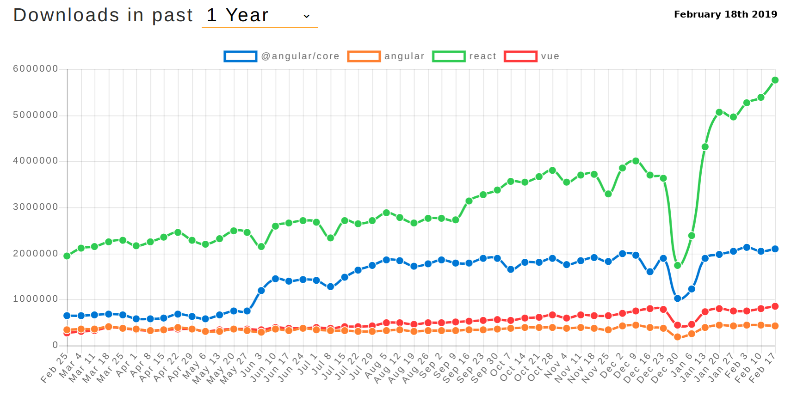

title: React & Co
subtitle: Much more fun than Angular :-)
class: animation-fade
layout: true

<!-- This slide will serve as the base layout for all your slides -->

.bottom-bar[
{{title}}
]

---

class: impact

# {{title}}

## {{subtitle}}

.title-oli[
Oliver Sturm &bull; @olivers &bull; oliver@oliversturm.com
]

.title-logo[

]

---

## Oliver Sturm

- Training Director at DevExpress
- Consultant, trainer, author, software architect and developer for over 25 years

- Contact: oliver@oliversturm.com

---

## Agenda

- A success story
- React - Do we need the basics?
- Functional React
- Redux
- Routing
- Sagas

---

## A Success Story

.svg-light-width[

]

---

## License trouble?

- React licensing used to be "BSD + Patents"
- Never mind what that means, it's now standard MIT

---

class: impact

# DEMO

---

## Sources

- This presentation:

  - https://oliversturm.github.io/react-and-co
  - PDF download: https://oliversturm.github.io/react-and-co/slides.pdf

- Demo code:

  - https://github.com/oliversturm/react-and-co

---

class: impact

# Thank You

Please feel free to contact me about the content anytime.

.title-oli[
Oliver Sturm &bull; @olivers &bull; oliver@oliversturm.com
]

.title-logo[

]
